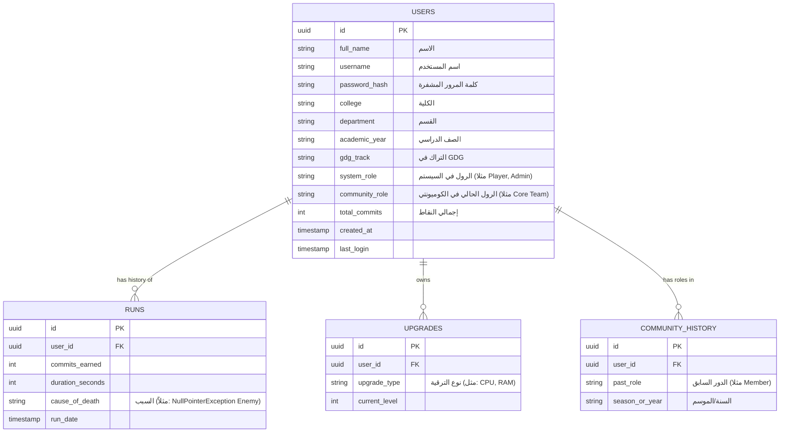

# 🗄️ مخطط قواعد البيانات (Database ERD)

## 📊 الكيانات والعلاقات

جداول مقترحة للـ PostgreSQL للتعامل مع تقدم اللاعبين:

### 🗃️ التفاصيل الإضافية (Caching)
* **Leaderboard View:** سيتم الاعتماد على Redis (`ZSET`) لحفظ الترتيب العام المباشر بناءً على الـ `total_commits` لضمان استرجاع قائمة الأوائل بسرعة فائقة `O(log(N))`.
* سيتم تحديث الـ Leaderboard بشكل غير متزامن (Asynchronous) لتخفيف العبء عن الـ Database.

---
⬅️ **العودة إلى لوحة التحكم:** [[00_Dashboard.md.md|لوحة التحكم الرئيسية]]
