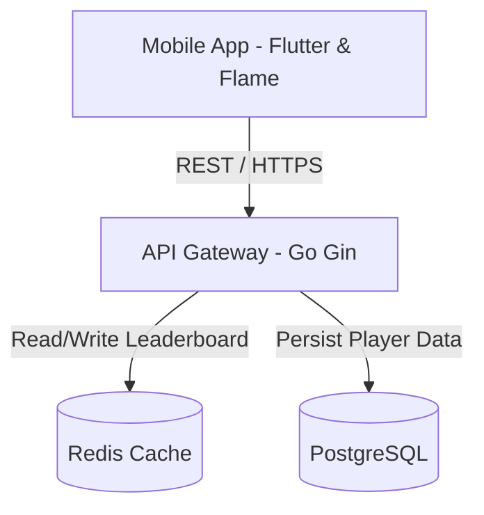

# 📐 المخطط العام للمشروع (High Level Design)

## 🌐 المعمارية العامة (The Big Picture)
اللعبة تعتمد على بنية هجينة بين أداء العميل القوي (Client-side) وخوادم موثوقة لحفظ التقدم التنافسي:

### 1. العميل (Client - Flutter & Flame):
* يتعامل مع الـ Micro-Loop بشكل كامل (الفيزياء، التصادم، الـ Rendering).
* محرك اللعبة (Flame) يعمل بمعزل عن واجهات المستخدم (Flutter Widgets).
* يتم تخزين حالة اللاعب المؤقتة (Commits in current Run) محلياً أثناء اللعب الفعلي لتجنب انقطاعات الاتصال.

### 2. بوابة الاتصال (API Gateway - Go lang):
* تستقبل نتائج الـ Run في حالة الـ Game Over (Push to Origin).
* تقوم بالتحقق من صحة البيانات لمنع الغش (Anti-cheat/Validation).

### 3. قواعد البيانات والكاش (PostgreSQL + Redis):
* PostgreSQL تحفظ الـ Profiles، والـ Meta-Progression (التطوير المستدام).
* Redis (أو Memcached) يتعامل مع الـ Leaderboard المباشر لضمان سرعة الاستجابة.

---
⬅️ **العودة إلى لوحة التحكم:** [[00_Dashboard.md.md|لوحة التحكم الرئيسية]]
